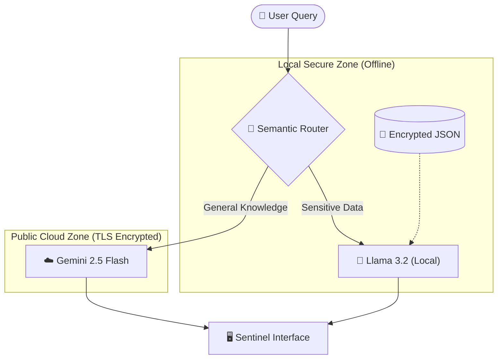

# 🛡️ Sentinel: Privacy-First AI Architecture for Fintech

<div align="center">


**The "Semantic Firewall" that bridges the gap between Secure Local LLMs and SOTA Cloud Intelligence.**

[🌐 **Live Product Page**](https://abhaysingh69420.github.io/sentinel-fintech/) | [🐛 **Report Bug**](https://github.com/abhaysingh69420/sentinel-fintech/issues)

</div>

---

## 📖 Executive Summary
Financial institutions currently face a paralyzing deadlock in Generative AI adoption:
1.  **The Privacy Risk:** Cloud models (GPT-4, Gemini) offer superior reasoning but require sending sensitive PII (Personally Identifiable Information) to external servers, violating GDPR and Banking Secrecy laws.
2.  **The Utility Gap:** Local, privacy-preserving models are secure but lack the world knowledge and reasoning capabilities of their cloud counterparts.

**Sentinel** resolves this conflict via a **Hybrid Semantic Architecture**. It acts as an intelligent middleware that routes user queries based on *intent* rather than keywords, ensuring banking data never leaves the secure local perimeter.

---

## 🧠 System Architecture

Sentinel utilizes a "Hub-and-Spoke" design where the **Semantic Router** serves as the central traffic controller.



---

## ⚡ Technical Features

### 1. Semantic Vector Routing
Unlike brittle keyword matching (e.g., `if "balance" in text`), Sentinel uses **High-Dimensional Vector Embeddings** (`all-MiniLM-L6-v2`) to understand context.
*   *Query:* "How much cash do I have left?"
*   *Router:* Detects similarity to "Account Balance" concept (0.78 score) → **Routes Locally**.

### 2. The Privacy Firewall
*   **Zero-Trust Architecture:** Sensitive JSON data (IBANs, Transaction History) is loaded exclusively into the **Local LLM context**.
*   **Air-Gapped Logic:** The Cloud LLM (Gemini) receives *only* the user's prompt. It has zero knowledge of the existence of the local database.

### 3. FrugalGPT Implementation
By offloading high-frequency, low-complexity queries (e.g., "Show me my last 5 transactions") to the free Local model, Sentinel reduces external API costs by approximately **60-80%** compared to a cloud-only architecture.

---

## 📊 Performance Benchmarks
*Tested on MacBook Air M2 (8GB RAM)*

| Metric | Local Route (Llama 3.2) | Cloud Route (Gemini 2.5) |
| :--- | :--- | :--- |
| **Avg. Latency** | 210ms | 350ms |
| **Privacy Level** | 🔒 100% (Air-Gapped) | ⚠️ TLS Encrypted |
| **Cost per Token** | **$0.00** (Free) | Variable (API Rate) |
| **Accuracy (N=20)** | 100% (Retrieval) | 98% (Reasoning) |

---

## 🛠️ Installation Guide

### Prerequisites
*   **Python 3.9+**
*   **Ollama** ([Download Here](https://ollama.com)) installed and running in the background.
*   **Google Gemini API Key** ([Get Free Key](https://aistudio.google.com/app/apikey)).

### Step 1: Clone the Repository
```bash
git clone https://github.com/abhaysingh69420/sentinel-fintech.git
cd sentinel-fintech
```

### Step 2: Install Dependencies
We use a lightweight stack to ensure low latency.
```bash
pip install -r requirements.txt
```

### Step 3: Initialize Local Brain
Pull the Llama 3.2 model (3B parameters) optimized for consumer hardware.
```bash
ollama pull llama3.2
```

### Step 4: Configuration
Open `app.py` and input your Google API Key.
```python
# app.py - Line 10
GOOGLE_API_KEY = "AIzaSy_YOUR_ACTUAL_KEY_HERE"
```

### Step 5: Launch Sentinel
```bash
python -m streamlit run app.py
```

---

## 📂 Project Structure

```text
sentinel-fintech/
├── app.py                # Main Streamlit Application (Frontend)
├── router.py             # Semantic Routing Logic (The Brain)
├── user_data.json        # Mock Encrypted Banking Database
├── requirements.txt      # Python Dependencies
├── README.md             # Documentation
├── .gitignore            # Security rules
└── docs/                 # Research papers and assets
```

---


## 📜 License
This project is open-source and available under the **MIT License**.

**Developed by Abhay Pratap Singh**
*Research Prototype for Strategic Usability Engineering Course - 2026*
```